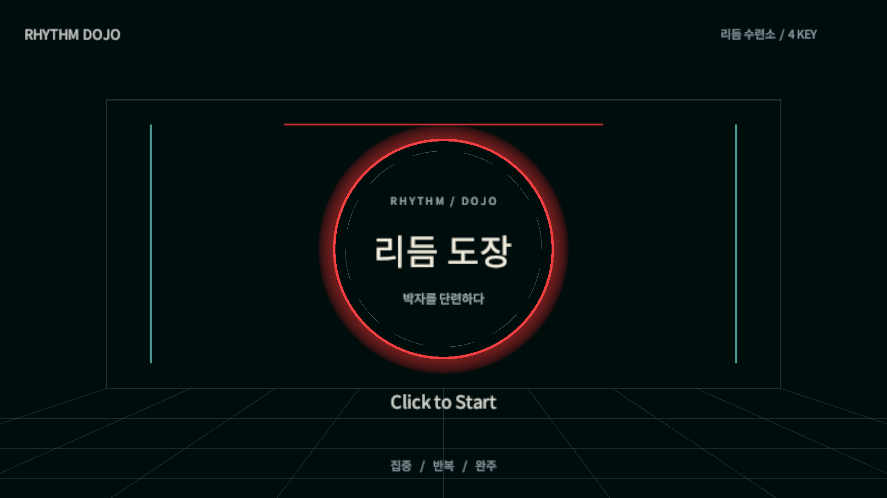
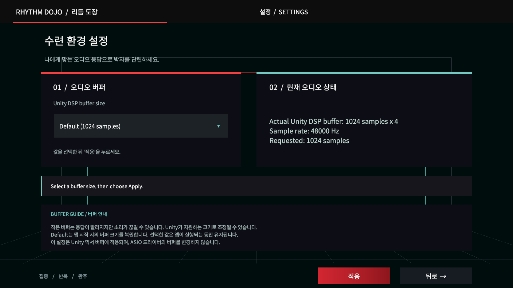
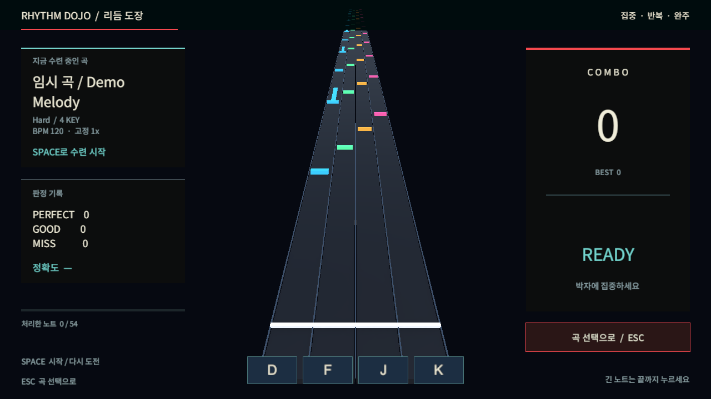
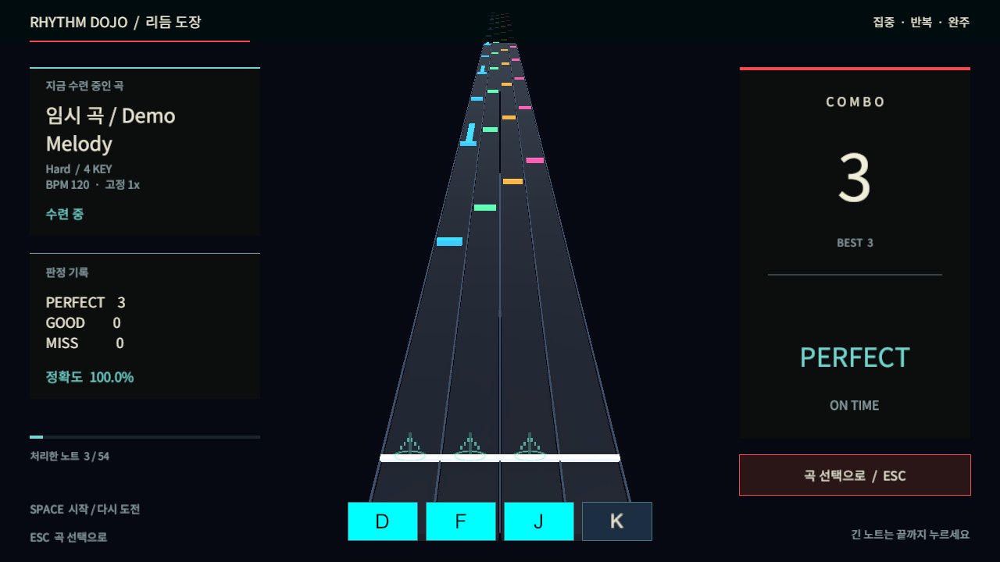

# Modern dojo UI and gameplay feedback

The title, song selection, settings, and gameplay HUD now share dark panels, cream text, red accents, and cyan feedback. Gameplay separates song information and judgment statistics from large combo and timing feedback, keeping the note highway clear.

A custom native cursor adds hover feedback, click ripples, and click audio. Scene cameras now retain an active audio listener through title, selection, settings, and gameplay transitions. Successful notes add a short synthesized hit sound, pooled lane bursts, and a small camera recoil; hold notes keep a glow until resolution. Chords share one attack sound per frame, and reset/scene return clears effects and restores the camera. Scoring and judgment rules are unchanged.

Lasting layouts live in the scene builders. Regenerate scenes with **Game Tools > Scenes > Build All Scenes**.

## Validation

- Unity 6000.3.23f1 compilation succeeded.
- GameplayHudFlowTests: 4 passed; DojoClickFeedbackTests: 3 passed; GameplayHitFeedbackTests: 3 passed.
- Hit tests verify actual audio output, silent misses, bounded pools, hold completion, camera restoration, rebinding, and scene cleanup.
- Windows standalone build succeeded after the hit feedback changes.
- Unity meta validation passed (218 staged GUIDs).
- The latest Foundation run ended with 117 EditMode tests passed and one timeout in SceneGenerationDoesNotWriteContentAssets while regenerating scenes in the live Editor. It did not proceed to the full PlayMode suite. The earlier complete Foundation run before hit feedback passed 118 EditMode and 45 PlayMode tests. Full Foundation verification still needs a rerun.

## Screenshots

